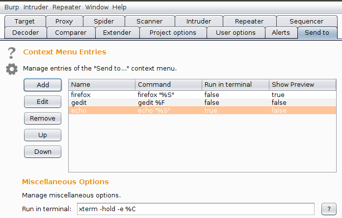
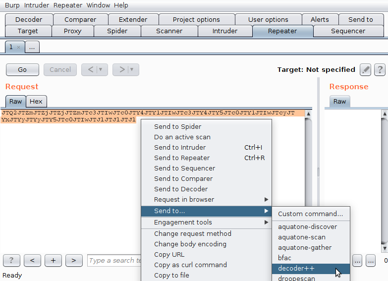
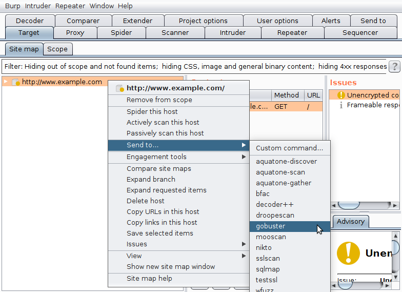
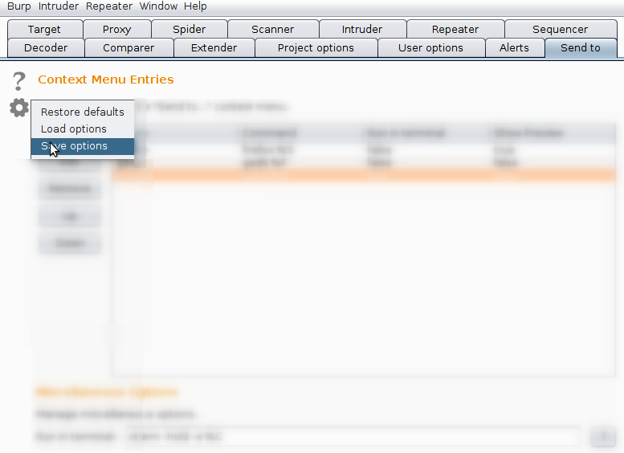

# Burp-Send-To-Extension

Adds a customizable "Send to..."-context-menu to your BurpSuite.

## Configuration

After loading the extension the "Send to"-Tab contains all necessary options to configure the "Send to"-context-menu. 

New context-menu-entries can be added using the "Add"-button. Each entry consists of following fields:
* **Name:** the name of the context-menu-entry.
* **Command:** the command to be executed. You can use following placeholders:
	* **%S:** will be replaced with the selected text
	* **%F:** will be replaced with the path to a temporary file which contains the selected text
* **Group:** the name of the sub-menu in which this entry will be shown. Can be left blank.
* **Run in terminal:** defines whether a terminal-window should appear in which the configured command is executed. By default "xterm" is used as terminal-emulator. You can change the terminal-emulator in the "Miscellaneous Options" to your liking.
* **Show preview:** gives you the chance to preview and change the command before executing it.
* **Output should replace selection:** will replace the selection with the output of the to be executed command.

After creating new context-menu-entries using the "Add"-button they can be edited or deleted again using the "Edit"- and "Remove"-button. In addition the order in which they appear in the context-menu can be altered using the "Up"- and "Down"-button.

## Context-Menu

The "Send to..." context-menu contains all entries which were added in the "Send to"-Tab.
In addition you can add new entries via the "Custom command..."-context-menu-entry.

## Save and load options

Usually the options of the "Send to"-Tab are saved automatically. However, if you switch computers you may save and load your current options. This can be done by clicking on the gear-symbol in the upper-left corner of the "Send to"-Tab and select the appropriate context-menu-entry.

## Security Notes

Executing commands based on untrusted input always introduces the risk of command injection. This is especially true when using the **%S** placeholder. Thus it is recommended to always activate the **Show preview** option when using the **%S** placeholder and closely analyse commands in the preview window prior to execution.

## Build

This project was built using IntelliJ and Gradle. When you make changes to the source (and especially the GUI) you should apply following settings within Intellij to make sure that everything builds successfully:
* File -> Settings -> Editor -> GUI Designer -> Generate GUI into: Java source
* File -> Settings -> Build, Execution, Deployment -> Compiler -> Build project automatically

When the GUI is not updated correctly you may rebuild the project manually:
* Build -> Rebuild Project

After that you can execute the "fatJar"-task within the "build.gradle"-file. This will produce a jar in the "build/libs/" directory called "burp-send-to-extension-{version}.jar".
